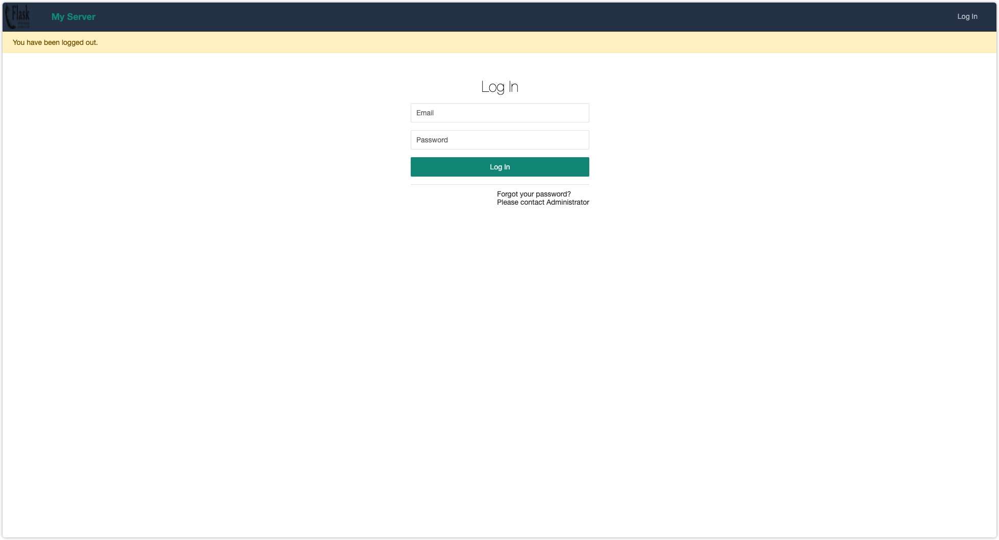
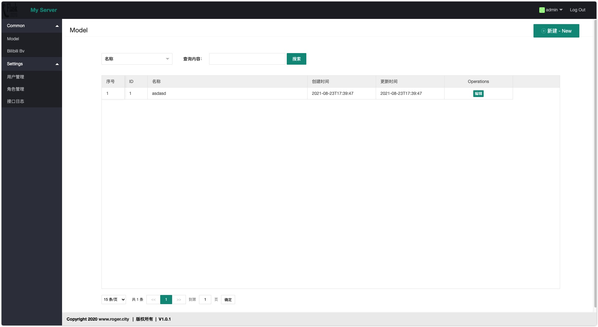

# My WebServer

[](https://www.python.org/downloads/)
[](https://github.com/RRRoger/MyWebserver-flask)
[](https://github.com/RRRoger/MyWebserver-flask/issues)
[](https://github.com/RRRoger/MyWebserver-flask/commits/master)
[](https://github.com/RRRoger/MyWebserver-flask/blob/master/LICENSE)

> Flask网站模板
>
> python + flask + LayUI + mysql





## Technology stack

- Python3.*
- [Flask](https://dormousehole.readthedocs.io/en/latest/)
- Mysql
- [Layui](https://www.layui.com/)

## Features

- 增删改查操作
- 用户管理
- 角色管理
- 权限管理

- 接口日志
- 搜索、分页
- 异常捕获

## Init

- 添加环境变量

```bash
export FLASK_APP=hello.py
```

- 创建数据库

```bash
# 进入数据库
mysql -uroot -p

# 创建爱你数据库
create database test_db charset=utf8;
```

- 初始化数据库

```bash
flask db init

# 第一次先删除`migrations`目录
rm -rf migrations

flask db migrate

# 修改数据库结构
flask db upgrade
```

- 初始化用户数据

```bash
# 初始化用户数据
flask init-tables
```


## Run

### 1. 普通启动方式

```bash
python hello.py
```

### 2. with gunicorn

- 安装`gunicorn` & `gevent`

```bash
pip install gunicorn
pip install gevent
```

- 使用`gunicorn`启动服务

```bash
cd MyWebserver-flask

gunicorn -c gunicorn.conf.py  hello:app  --preload -b 0.0.0.0:5000

# 后台启动
gunicorn -c gunicorn.conf.py  hello:app  --preload -b 0.0.0.0:5000 --daemon
```

## 如何关闭进程?

- `ps -ef|grep gunicorn`

```bash
roger    12434     1  0 15:15 ? 00:00:02 ...... -b 0.0.0.0:5000 --daemon
roger    12442 12434  0 15:15 ? 00:00:01 ...... -b 0.0.0.0:5000 --daemon
roger    12443 12434  0 15:15 ? 00:00:01 ...... -b 0.0.0.0:5000 --daemon
roger    12444 12434  0 15:15 ? 00:00:01 ...... -b 0.0.0.0:5000 --daemon
roger    12445 12434  0 15:15 ? 00:00:01 ...... -b 0.0.0.0:5000 --daemon
roger    12446 12434  0 15:15 ? 00:00:01 ...... -b 0.0.0.0:5000 --daemon
roger    12447 12434  0 15:15 ? 00:00:01 ...... -b 0.0.0.0:5000 --daemon
roger    12448 12434  0 15:15 ? 00:00:01 ...... -b 0.0.0.0:5000 --daemon
roger    12449 12434  0 15:15 ? 00:00:01 ...... -b 0.0.0.0:5000 --daemon
roger    12450 12434  0 15:15 ? 00:00:01 ...... -b 0.0.0.0:5000 --daemon
```

- 删除父进程

```bash
kill -9 12434
```

## 查看日志

```bash
# 访问日志
tail -f ~/log/gunicorn_access.log

# 接口日志
tail -f ~/log/gunicorn_info.log
```